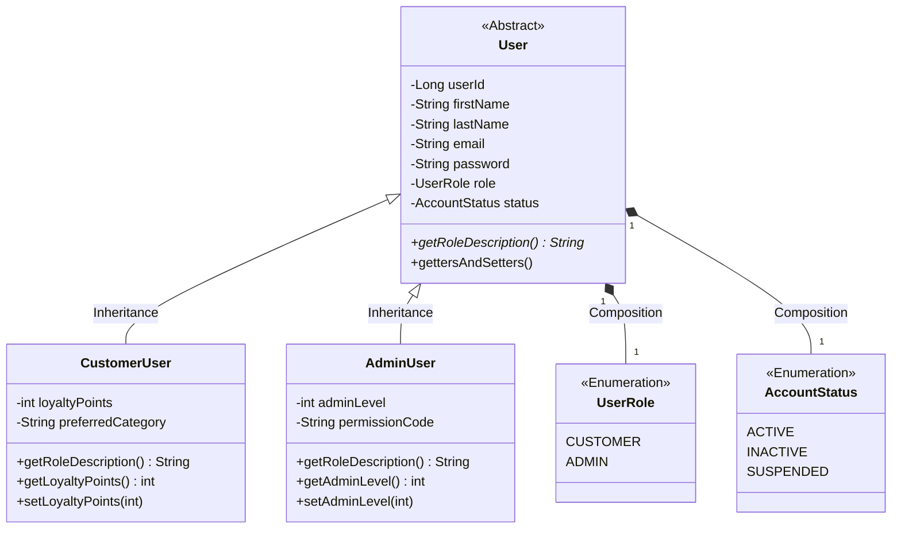
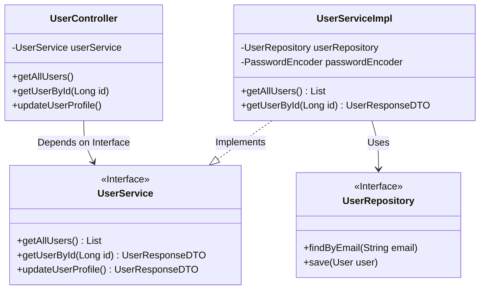

# Architecture & Class Diagrams

Here are the visual charts representing the code we generated. These charts will be very helpful for your university project presentation and documentation.

## 1. Object-Oriented Class Diagram

This diagram visualizes the **Inheritance**, **Encapsulation**, and **Polymorphism** in your models.



## 2. Abstraction & Interface Diagram

This diagram shows how the Controller interacts with the Service Interfaces (Abstraction), hiding the implementation details.



## 3. System Architecture & Flow Chart

This flowchart demonstrates the MVC (Model-View-Controller) architecture and how data flows from the frontend to the database.

```mermaid
flowchart TD
    %% Frontend Layer
    subgraph Frontend [Frontend (HTML/CSS/JS)]
        UI[User Dashboard UI]
        Auth[Login/Register UI]
        JS[Fetch API Calls]
    end

    %% Backend Layer (Spring Boot)
    subgraph Backend [Backend (Spring Boot MVC)]
        RC[REST Controllers\nAuthController / UserController]
        SV[Service Layer\nAuthService / UserService]
        RP[Repository Layer\nUserRepository]
        MD[Models / Entities\nUser / CustomerUser / AdminUser]
    end

    %% Database Layer
    subgraph DB [Database]
        MySQL[(MySQL Database)]
    end

    %% Flow connections
    UI --> JS
    Auth --> JS
    JS -- JSON HTTP Requests --> RC
    RC -- DTOs --> SV
    SV -- Business Logic / BCrypt --> RP
    RP -- Entity Objects --> MD
    RP -- JPA/Hibernate SQL --> MySQL
    MySQL -- Result Set --> RP
    SV -- Maps to Response DTO --> RC
    RC -- JSON HTTP Response --> JS
```
